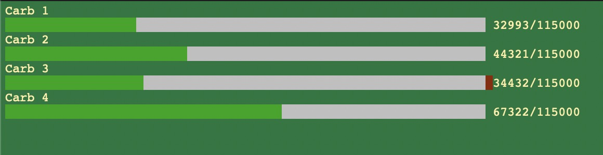

# HX710B for RPi

Python script to read 4x HX710B sensors on Raspberry Pi.

Tool used for carb synchronisation application.

Build on top of [hx711](https://github.com/tatobari/hx711py)


More sophisticated version of carb synchronizer can be found [here](https://github.com/zilberas/CarbSync)


## Usage

Install dependencies

```bash
python carbSync.py
```

## License
[Apache License, version 2.0.](http://www.apache.org/licenses/LICENSE-2.0)
